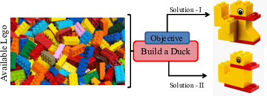

### Publication
1. Pal, Ratnabali, Samarjit Kar, and Arif Ahmed Sekh. "Customizable and Programmable Deep Learning." 
International Conference on Pattern Recognition. Cham: Springer Nature Switzerland, 2024.
https://munin.uit.no/bitstream/handle/10037/36964/article.pdf?sequence=2&isAllowed=y 

### Abstract
In this study, we explore the potential of pre-trained deep learning models, proposing a new approach that
emphasizes their reusability and adaptability. Our framework, termed “customizable” deep learning,
facilities users to seamlessly integrate diverse pre-trained models for addressing new tasks and enhancing
existing solutions. Furthermore, we introduce a “programmable” adapter that enables the flexible
combination of different pre-trained modules, expanding the range of applications and customization
options. Through empirical experiments, particularly focusing on Visual Question Answering (VQA) for
visually impaired (VI) individuals, we demonstrate the practical effectiveness of our methodology. These
contributions advance the deep learning field while promoting customization and re-usability across
various domains and tasks. The code is available https://github.com/Ratnabali-Pal/CPDA-VQA.

### License

Copyright © 2021 Ratnabali Pal

The content of this repository is bound by the following licenses:

- The documents and data are licensed under the MIT license.
